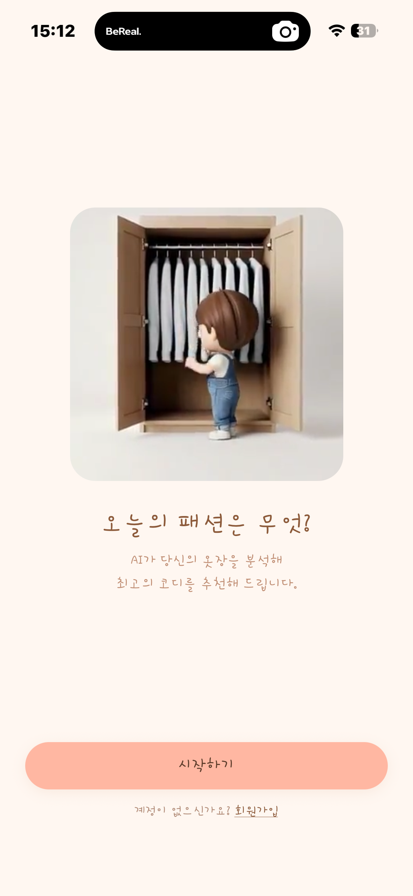
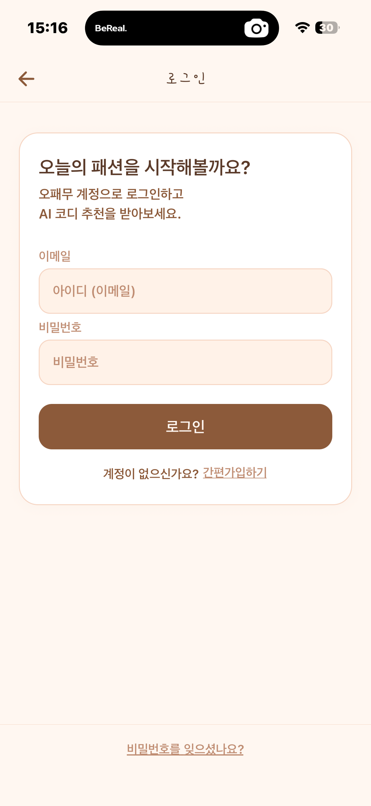
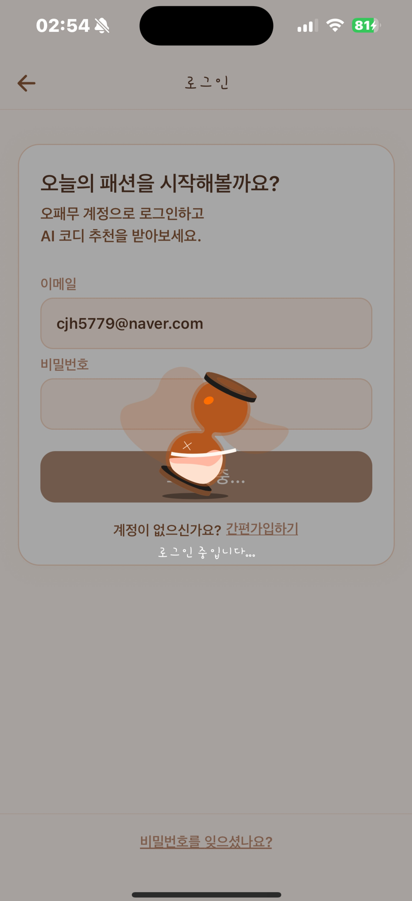
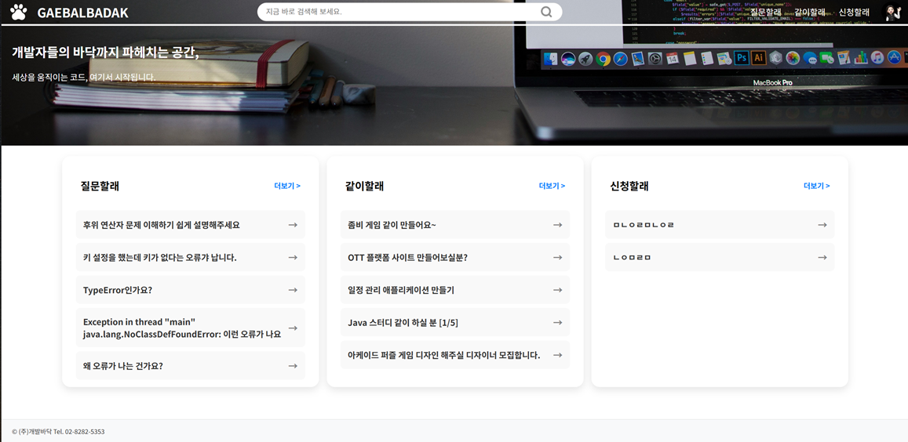
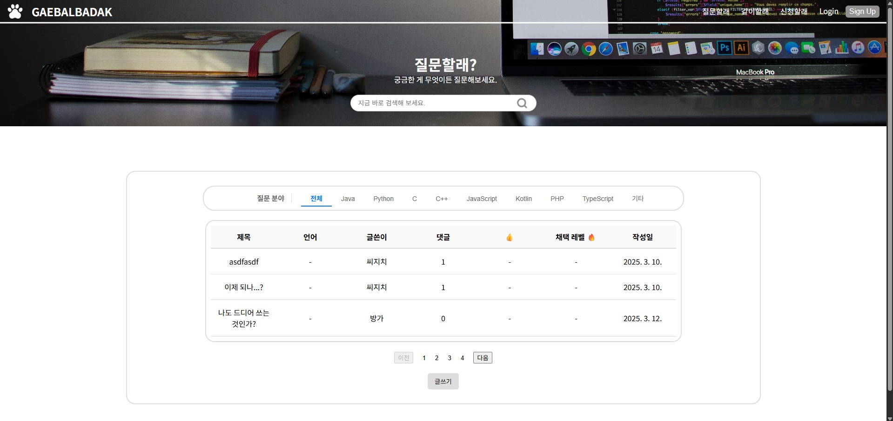
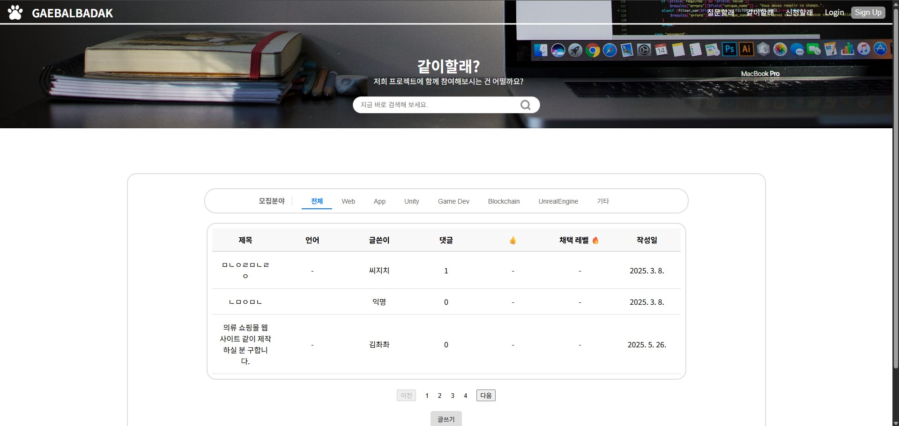
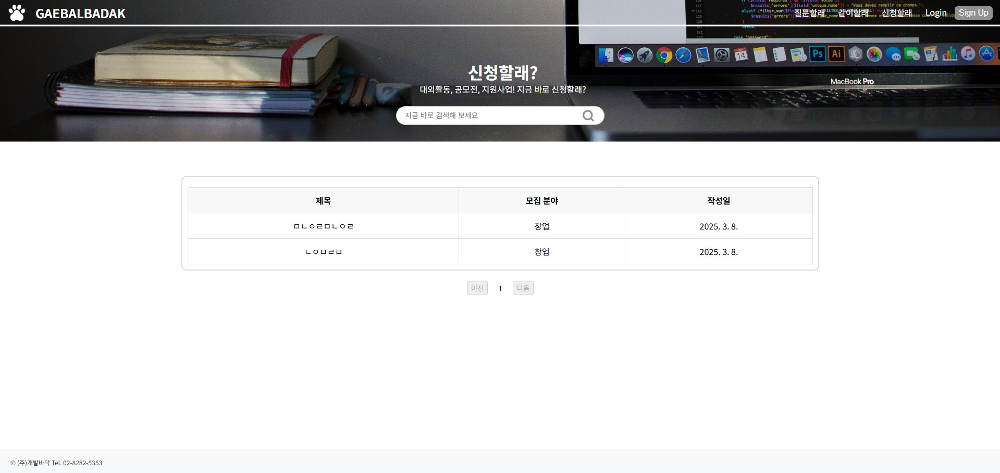
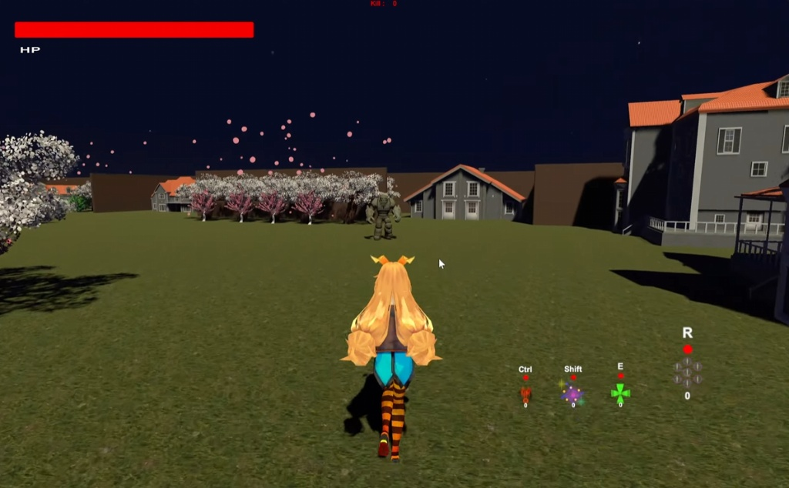

## 🖐️ Introduction
- **이름:** 최정환
- **생년월일:** 2002.11.01
- **소속:** 한림대학교 정보과학대학 소프트웨어학부 콘텐츠IT / 빅데이터
- **Email:** cjh5779@naver.com

 

## 🛠️ Tech Stacks

**Frontend & Mobile**  
     

**Backend & App**  
  

**AI & Data**  
 

**Tools**  
    

 

## 🏃‍♂️‍➡️ Activities 

**교내 활동**
* 2026 소프트웨어학부 제 8대 콘텐츠IT 학생회 '유니온' 사무부장
* 2025 논리설계 및 실험 전공과목 멘토링 활동 (멘토)
* 2025.05 한림대학교 디지털 경진대회 참가
* 2025 소프트웨어학부 씨애랑 학술동아리 부원
* 2024 자료구조 전공과목 멘토링 활동 (멘티)
* 2024 소프트웨어학부 제 6대 콘텐츠IT 학생회 'Clear' 총무국장

**교외 활동**
* 2026.06 ~ 2026.12 [현대이지웰/9회차] Java 풀스택 개발자 부트캠프
* 2024-동계 온라인 현직자 직무부트캠프-코멘토SQL

 

## 💻 Projects

### 🎮 Tic-Tac-Toe - React 기본 개념 실습 🔎 [깃허브](https://github.com/cjh5779/react-todo-app)
> **"React의 핵심인 컴포넌트 분리와 불변성을 이해하는 첫걸음"**  
> **기간:** 2026.07

React 공식 문서의 틱택토(Tic-Tac-Toe) 튜토리얼을 따라가며, 컴포넌트 간의 데이터 전달과 배열의 불변성(Immutability) 유지, 그리고 동적인 UI 업데이트 로직을 TypeScript 환경에서 학습하기 위해 진행한 실습 프로젝트입니다.

* **사용 기술:**   

**💻 구현 화면 (Screenshots)**

| 게임 진행 화면 | 승리 판정 화면 |
| :---: | :---: |
|  |  |

* **🧑‍💻 주요 학습 내용 및 구현 로직**
  * **TypeScript 기반 타입 안정성 확보:** `Square` 컴포넌트의 Props나 보드의 상태(State) 데이터 구조를 타입(Type)으로 명시하여, 런타임 에러를 사전에 방지하고 코드의 안정성과 가독성 향상
  * **상태 끌어올리기 (Lifting State Up):** 개별 격자(Square) 컴포넌트가 아닌 상위 부모 컴포넌트(Board)에서 데이터를 관리하도록 설계하여, 여러 자식 컴포넌트 간의 데이터를 원활하게 공유하고 동기화하는 React의 단방향 데이터 흐름 학습
  * **불변성(Immutability)과 최적화:** 배열 데이터를 직접 수정하지 않고 `slice()` 또는 스프레드 연산자를 활용해 새로운 복사본을 생성하여 업데이트함으로써, React가 데이터 변화를 감지하고 렌더링을 최적화하는 원리 이해
  * **시간 여행(Time Travel) 기능 구현:** 매 턴마다의 보드 기록(History)을 배열에 저장하고, `map()` 함수를 활용해 과거의 특정 시점으로 게임을 되돌릴 수 있는 동적인 UI 버튼과 복원 로직 구현

### 📚 Book Manager - 도서 관리 UI 애플리케이션 🔎 [깃허브](https://github.com/cjh5779/book-manager)
> **"React 컴포넌트 기반의 직관적인 도서 관리 정적 페이지"**  

React의 컴포넌트 기반 UI 구성과 정적 데이터 렌더링(Static Data Rendering)을 연습하기 위해 로컬 환경에서 개발한 토이 프로젝트입니다.

* **사용 기술:**   

**💻 구현 화면 (Screenshots)**

| 도서 목록 (메인 화면) |
| :---: |
|  |

* **🧑‍💻 나의 주요 기여 및 담당 역할**
  * **MUI 기반 그리드 UI 설계:** Material-UI(MUI)의 `Card`, `Grid`, `Stack` 컴포넌트를 활용하여 일관된 디자인을 구현하고, `sx` 속성을 통해 도서 목록을 직관적인 반응형 그리드 형태로 배치
  * **Mock Data 자동 생성 및 렌더링:** `Array.from` 메서드와 조건부 연산(`index % 2`)을 활용해 카테고리가 분류된 16개의 더미(Dummy) 데이터를 프로그래밍 방식으로 생성하고, 이를 `map()` 함수로 렌더링하여 하드코딩 최소화
  * **TypeScript 및 Props 최적화:** `Book` 타입을 명시하여 데이터 구조의 안정성을 높이고, 하위 컴포넌트로 데이터 전달 시 스프레드 연산자(`{...book}`)를 사용하여 가독성과 효율성 개선

### 👕 Hambugi - AI 기반 패션 추천 모바일 애플리케이션 🔎 [깃허브](https://github.com/cjh5779/Hambugibugi)
> **"나만의 AI 스타일리스트, 스마트한 패션의 완성"**  
> **기간:** 2025년 하반기 (캡스톤 디자인)

사용자의 이미지를 분석하여 최적의 패션을 추천해 주는 AI 모델 연동 모바일 앱 서비스입니다. 본 리포지토리는 사용자와 맞닿는 모바일 프론트엔드 구현 코드를 담고 있습니다.

* **사용 기술:**     

**📱 앱 화면 미리보기 (Screenshots)**

| 메인 (시작 화면) | 로그인 화면 | 로딩 화면 | AI 분석 및 추천 결과 |
| :---: | :---: | :---: | :---: |
|  |  |  |  |

* **🧑‍💻 나의 주요 기여 및 담당 역할 (Frontend)**
  * **모바일 UI/UX 및 전체 화면 퍼블리싱:** Figma를 활용하여 디자인을 기획하고, React Native와 Expo를 활용하여 메인 화면, 이미지 업로드, 추천 결과 뷰 등 직관적이고 사용자 친화적인 전체 앱 화면 레이아웃 설계 및 구현
  * **네비게이션 및 컴포넌트 모듈화:** React Navigation을 적용하여 로그인 및 메인 탭 간의 매끄러운 화면 전환(Routing) 로직을 구축하고, 재사용 가능한 UI 컴포넌트를 분리하여 코드 유지보수성 향상
  * **로그인 뷰 및 디바이스 제어 로직:** 사용자 인증을 위한 로그인 페이지 UI 및 폼(Form) 상태 관리를 구현하고, 사용자의 사진 업로드를 위한 디바이스 갤러리/카메라 접근 권한 등 모바일 프론트엔드 핵심 기능 세팅

 

### 📝 AI 생성 텍스트 분류 모델 개발 (TEAM) 🔎 [깃허브](https://github.com/cjh5779/AI-Text-Classifier)
> **"사람과 AI의 문장, 그 미세한 차이를 판별하다"**  
> **기간:** 2025.05.13 ~ 2025.05.26

주어진 텍스트가 AI에 의해 생성된 것인지, 사람이 직접 작성한 것인지 정확하게 구분해 내는 이진 분류(Binary Classification) AI 모델 개발 프로젝트입니다.

* **사용 기술:**  

* **🧑‍💻 나의 주요 기여 및 담당 역할**
  * **자연어 처리 모델 구조 설계:** 한국어 텍스트 특성에 맞춰 KLUE BERT 토크나이저 및 임베딩을 적용하고, 문맥의 순차적 정보를 잘 반영하는 LSTM 기반의 분류기(Classifier)를 결합하여 하이브리드 모델 구축
  * **모델 최적화 및 하이퍼파라미터 튜닝:** 경험적 탐색 과정을 거쳐 모델 파라미터를 세팅하고, AdamW 옵티마이저와 Scheduler를 활용해 학습률(Learning Rate)을 동적으로 조절하며 학습 안정성 및 성능 극대화
  * **K-Fold 교차 검증 및 앙상블 기법 적용:** 과적합을 방지하고 일반화 성능을 향상시키기 위해 K-Fold (k=5) 교차 검증을 도입하여 5개의 개별 모델을 학습시킨 후, Soft Voting 앙상블 기법으로 최종 예측 결과를 도출하여 테스트 정확도(Accuracy) 향상
 
 

### 🐾 개발바닥 (GAEBALBADAK) - 개발자를 위한 커뮤니티 플랫폼 🔎 [깃허브](https://github.com/cjh5779/gaebalbadak)
> **"개발자들의 바닥까지 파헤치는 공간, 세상을 움직이는 코드 여기서 시작됩니다."**  
> **기간:** 2025.02.13 ~ 2025.04.01

커뮤니티를 통한 코드 질문과 오류 해결, 스터디 모집, 대회 및 부트캠프 공고 등 개발자들을 위한 다양한 맞춤형 정보를 제공하는 웹 서비스입니다.

* **사용 기술:**      

**💻 나의 구현 화면 (Screenshots)**

| 메인 홈 화면 | 질문할래 게시판 | 같이할래 게시판 | 신청할래 게시판 |
| :---: | :---: | :---: | :---: |
|  |  |  |  |

* **🧑‍💻 나의 주요 기여 및 담당 역할**
  * **프로젝트 기획 및 UI/UX 설계:** 전반적인 웹 서비스 기획을 주도하고, Figma를 활용하여 전체 화면 디자인 설계
  * **게시판 UI 및 라우팅 구현:** React를 활용해 메인 홈 화면과 '질문할래', '같이할래', '신청할래' 등 핵심 게시판 UI를 직접 전담하여 개발하고, 각 카테고리 클릭 시 상세 페이지로 동적 이동하도록 라우팅(Routing) 로직 구현
  * **인증 시스템 및 컴포넌트 최적화:** 재사용 가능한 컴포넌트 기반으로 로그인 및 회원가입 페이지를 구축하고, Firebase(Authentication, Firestore)를 연동하여 안전한 사용자 인증 및 DB 처리 파이프라인 완성

 

### 🪄 마법소녀의 마을을 지키는 액션 어드벤처 게임 🔎 [깃허브](https://github.com/cjh5779/VR-AR-Production)
> **기간:** 2024.11.08 ~ 2024.11.28

마법소녀의 마을을 침임한 골렘들과 그들의 왕을 마법을 통해 물리쳐 마을을 지키는 액션 어드벤처 게임입니다.

* **사용 기술:** Unity Engine, C#

**🎮 게임 플레이 화면 (Screenshots)**

| 맵 전경 | 보스 몬스터 스킬 | 캐릭터 궁극기 | 게임 종료 화면 |
| :---: | :---: | :---: | :---: |
|  |  |  |  |

* **🧑‍💻 나의 주요 기여 및 담당 역할**
  * **맵 디자인 및 환경 구성:** Unity 씬(Scene)을 활용하여 게임의 배경이 되는 전체적인 마을 맵 레이아웃을 기획하고 각종 에셋과 오브젝트를 배치하여 게임 환경 구축
  * **메인 캐릭터 스킬 로직 개발:** 플레이어(마법소녀)의 궁극기 등 전투 스킬 메커니즘을 C# 스크립트로 구현하여 타격감 있고 매끄러운 액션 시스템 개발
  * **몬스터 상호작용 및 이펙트 처리:** 보스 및 적(골렘)이 플레이어를 공격할 때 발생하는 시각적 이펙트와 피격 판정 상호작용을 구현하여 게임의 긴장감과 몰입도 향상

### 📊 GitHub Stats

  

